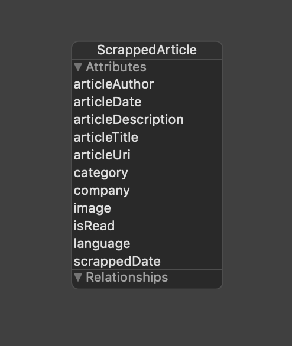
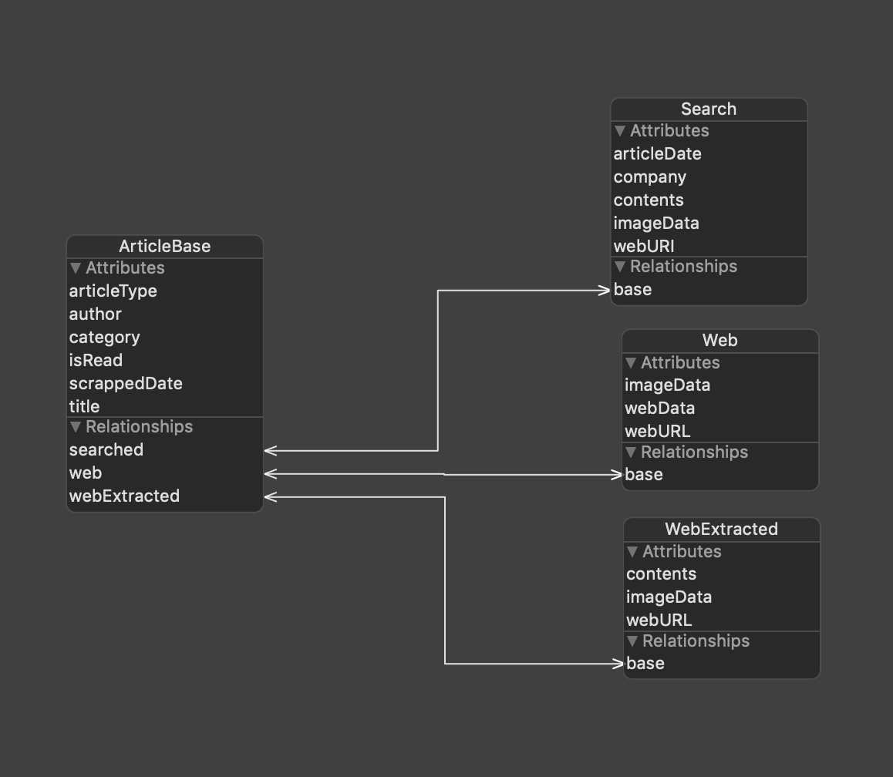
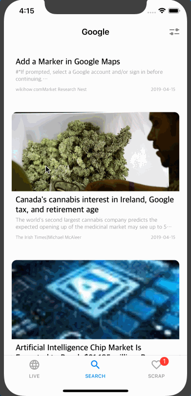
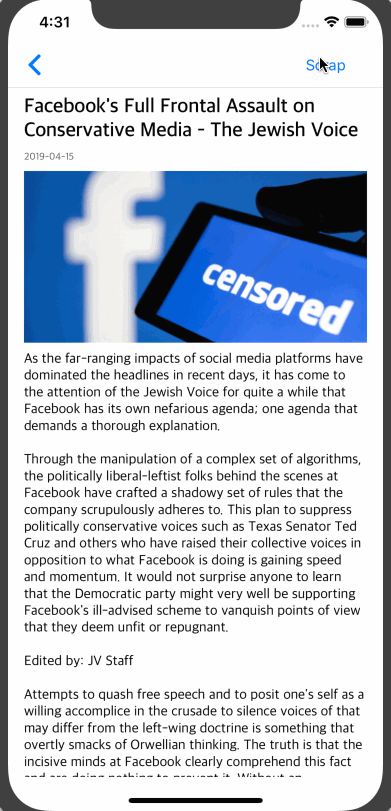
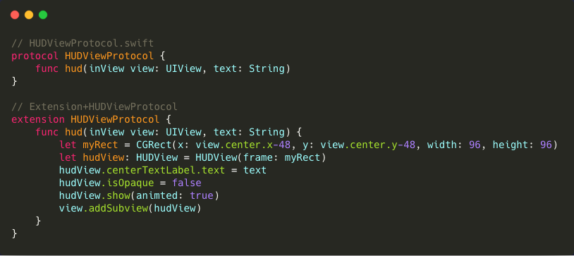

# tŕee
> 전 세계 이슈(급상승 검색어, 뉴스 기사)를 실시간으로 제공하는 애플리케이션

## 개발 기간
> 2019.01.21 - 2019.02.22

### + Refactoring

- 개인적으로 짧은 시간동안 하지 못했던 부분들에 대해서 아쉬움이 남아 추가 개발을 진행하게 되었습니다.
- 다음과 같은 부분들을 진행하였습니다.
    - 코어데이터 리팩토링
    - 사용성 증진 ( With HUDView )
- 간단한 설명과 함께 [하단](#Refactoring)에서 확인할 수 있습니다.

> 2019.03 ~ 2019.04
>
> [미니 프로젝트](https://github.com/onemoongit/Practice-iOS/tree/master/PR_CoreData)

## Team Gardener
> BoostCamp 3th A-1 Team
- tutor : yagom 
- [박성준](https://github.com/godpp) 
- [김혜리](https://github.com/kimhyeri) 
- [김현태](https://github.com/onemoongit)

## 주요 기술
- HTTP Networking Library - [Booster](https://github.com/godpp/Booster)
- Image Caching
- CoreData
- Siri Shortcuts

## 👨‍🏫 Tutoring Log

* [Week1](https://github.com/boostcamp3-iOS/team-a1/wiki/Week1)
* [Week2](https://github.com/boostcamp3-iOS/team-a1/wiki/Week2)
* [Week3](https://github.com/boostcamp3-iOS/team-a1/wiki/Week3)
* [Week4](https://github.com/boostcamp3-iOS/team-a1/wiki/Week4)

## 📝 Assignment

* [Week1](https://github.com/boostcamp3-iOS/team-a1/wiki/Week1-Assignment)
* [Week2](https://github.com/boostcamp3-iOS/team-a1/wiki/Week2-Assignment)
* [Week3](https://github.com/boostcamp3-iOS/team-a1/wiki/Week3-Assignment)

## GROUND RULE

* 공통된 코드 컨벤션을 사용합니다.
  - [Wiki](https://github.com/boostcamp3-iOS/team-a1/wiki/Swift-Style-Guide)에 정의하였습니다.
* 코드의 효율성을 증대시킵니다.
  - 재사용 가능한 부분에 대해서는 모듈로 활용하여 사용합니다.
  - PR에 대한 코멘트를 활용하여 서로의 코드를 적극적으로 리뷰합니다.
* 대화를 통한 적극적인 피드백을 주고받습니다.
  - 매일 아침 10시부터 데일리 스크럼을 통해 어제 한 작업을 공유하고 오늘 해야할 작업을 명확하게 설정합니다.

## 기능 트리

## 구성 화면 

> LIVE

- 각 나라별 급상승 검색어가 날짜순으로 나열되고 확인할 수 있습니다.

- 그래프를 통해서 사람들의 관심도가 시간에 따라서 어떻게 달라지는지 확인할 수 있습니다.

- 카테고리별로 전세계 주요 이슈들을 확인할 수 있습니다.

> SEARCH

- 자신이 원하는 키워드를 검색할 수 있습니다.

- 필터를 통해서 원하는 카테고리 내용 언어 등을 설정하여 검색이 가능합니다.

> SCRAP

- Live & Search 탭에서 자신이 스크랩한 기사들을 확인할 수 있습니다. 

- 네트워크가 없더라도 언제 어디서나 기사들을 확인하고 읽을 수 있습니다.

## Refactoring 

#### CoreData Architecture

#### why? 

- 확장을 생각해봤을 때
  - 기존의 구조는 하나의 엔티티에 필요한 모든 속성을 추가하였다.
  - 현재 까지는 관리가 그다지 까다롭지 않았으나관리적인 측면에서 모든 속성을 하나의 엔티티에 관리하기에는 많은 체크가 필요하다고 생각 결국 사용성이 떨어진다.
    - 예를 들어서 search를 통한 데이터에 `search keyword` 라는 속성이 추가될 때 거대한 엔티티에 추가 하는 것이 아닌 Search 라는 관계를 통해서 만들어진 엔티티에만 속성을 추가하면 된다.
  - 따라서 이를 기본적으로 저장하는 `ArticleBase`라는 엔티티를 만들고 관계를 추가하는 방식으로 변경하였다. 
- NSFetchedResultsController 
  - 다른 탭에서 추가 및 삭제를 했을 때 scrapViewController에서 변경 시점을 확인해 필요한 동작을 할 수 있도록 하였다.
    - 예를 들어서 다른 탭에서 스크랩을 한 경우 resultController에서 이를 확인한 뒤 탭 badge의 수를 확인할 수 있다.

#### Scrap HUDView

#### why? 

- 사용자가 스크랩을 했는지 안했는지 확인할 수 없었다.
  - 물론 scarp tab에 간 경우에 확인할 수 있다.
  - 하지만 바로바로 확인을 하는 것이 맞다고 판단하였다. 따라서 HUDView를 만들기로 함
    - HUD (Head Up Display)
  - Protocol 초기 구현을 통해서 scrap 을 하는 클래스에만 프로토콜을 채택하고 `hud(inView:text:)` 를 통해서 쉽게 사용할 수 있도록 하였다. 

